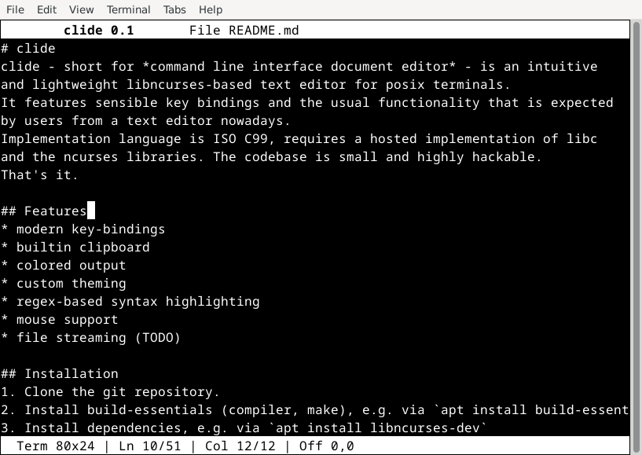

# clide
clide - short for *command line interface document editor* - is an intuitive
and lightweight libncurses-based text editor for posix terminals.
It features sensible key bindings and the usual functionality that is expected
by users from a text editor nowadays.
Implementation language is ISO C99, requires a hosted implementation of libc
and the ncurses libraries. The codebase is small and highly hackable.  
That's it.



## Features
* modern key-bindings
* builtin clipboard
* colored output
* custom theming
* regex-based syntax highlighting
* mouse support
* file streaming (TODO)

## Installation
1. Clone the git repository.
2. Install build-essentials (compiler, make), e.g. via `apt install build-essential`
3. Install dependencies, e.g. via `apt install libncurses-dev`
4. Run `make` in the root directory of the repository

## Keymap
```
Ctrl+A :  Select everything
Ctrl+C :  Copy selection
Ctrl+F :  Search text
Ctrl+G :  Goto line number, column number
Ctrl+H :  Display help window
Ctrl+I :  Display info window
Ctrl+L :  Select current line
Ctrl+O :  Open a new file
Ctrl+Q :  Quit editor
Ctrl+R :  Replace text
Ctrl+S :  Save file to disk
Ctrl+V :  Paste clipboard contents
Ctrl+X :  Cut selection
Ctrl+Y :  Redo last action
Ctrl+Z :  Undo last action
```

## Porting
The program is cross-platform except for the following dependencies:
* libncurses-dev (A replacement implementation could be pdcurses)
* GNU getopt (Replacement implementations are everywhere)

## License
clide is open source software and licensed under the terms of the MIT License.
